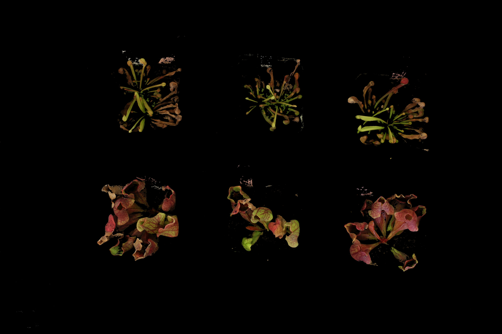
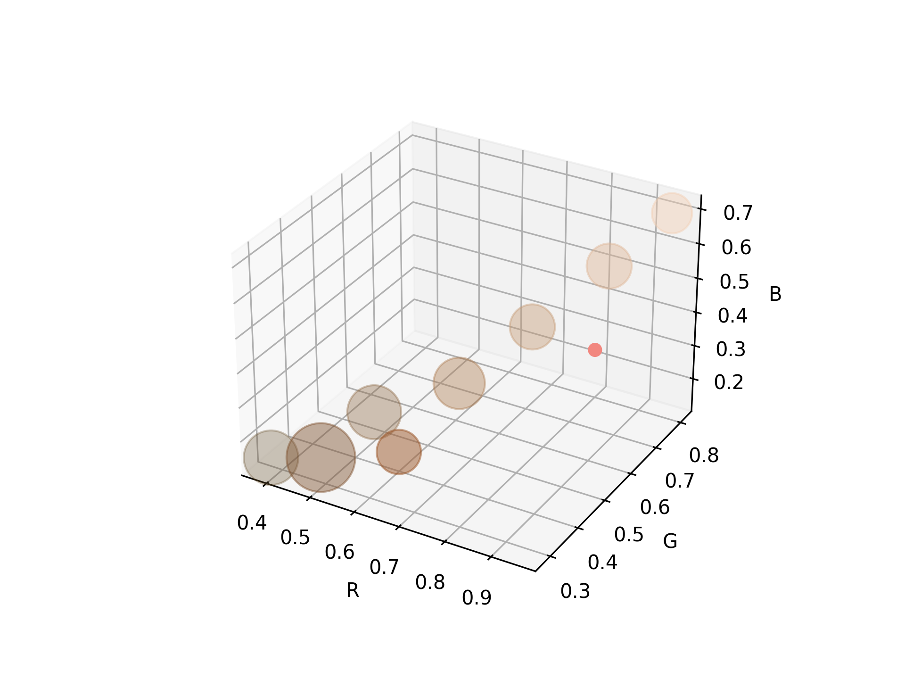

# Sarracenia pitcher plants

[](https://github.com/w-bonelli/pytcherplants/actions/workflows/ci.yaml)
[](https://coveralls.io/github/w-bonelli/pytcherplants?branch=main)


Trait and color analysis for top-down images of pitcher plants, built with [ilastik](https://www.ilastik.org/), [OpenCV](https://github.com/opencv/opencv-python), and [Deep Plant Phenomics](https://github.com/p2irc/deepplantphenomics). Developed for images obtained from an experiment performed by [Mason McNair](https://github.com/mmcnair91) at the University of Georgia.

<!-- START doctoc generated TOC please keep comment here to allow auto update -->
<!-- DON'T EDIT THIS SECTION, INSTEAD RE-RUN doctoc TO UPDATE -->


- [About](#about)
  - [Layout](#layout)
  - [References](#references)
- [Installation](#installation)
  - [Using Docker](#using-docker)
  - [Using Singularity](#using-singularity)
  - [Installing the Python package](#installing-the-python-package)
  - [Setting up a development environment](#setting-up-a-development-environment)
    - [Developing with Docker](#developing-with-docker)
    - [Using a virtual Python environment](#using-a-virtual-python-environment)
      - [`venv`](#venv)
      - [Anaconda](#anaconda)
- [Usage](#usage)
  - [Image name format](#image-name-format)
  - [Commands](#commands)
    - [Pixel classification](#pixel-classification)
    - [Plant segmentation](#plant-segmentation)
    - [Color analysis](#color-analysis)

<!-- END doctoc generated TOC please keep comment here to allow auto update -->

## About

This repository does a few things:

- pixel classification
- plant segmentation
- color distribution analysis

| Pixel Classification | Plant Segmentation             |            Color Analysis             | 
|:----------------------------:|:----------------------------:|:-------------------------------------:|
|  |   |   |

### Layout

Some sample images and data are included in `samples`. The Python module and CLI are defined in `pytcherplants`. Analysis is in `notebooks`.

### References

Pixel classification (via [Ilastik](https://www.ilastik.org/)) adapted from [Peter Pietrzyk's](https://github.com/PeterPieGH) [DIRTmu](https://github.com/Computational-Plant-Science/DIRTmu). Segmentation and analysis adapted from [SMART](https://github.com/Computational-Plant-Science/SMART) by [Suxing Liu](https://github.com/lsx1980).

## Installation

Docker or Singularity are recommended to run this project. The Ilastik pixel classification model necessary for certain commands is baked into the Docker image definition.

### Using Docker

The Docker image is available on Docker Hub at [`wbonelli/pytcherplants`](https://hub.docker.com/r/wbonelli/pytcherplants). To open an interactive shell with your current working directory mounted to `/opt/dev` inside the container:

```shell
docker run -it -v $(pwd):/opt/dev -w /opt/dev wbonelli/pytcherplants bash
```

### Using Singularity

To open an interactive shell:

```shell
singularity shell wbonelli/pytcherplants
```

Note that Singularity automatically mounts the current working directory; there is no need to manually load a volume.

### Installing the Python package

The `pytcherplants` Python package can be installed with pip, e.g. `pip install pytcherplants`. **Note that the pixel classification commands expect Ilastik to be installed at `/opt/ilastik/ilastik-1.4.0b21-gpu-Linux/`.**

### Jupyter notebooks

To run a local Jupyter notebook server from a suitable python environment (i.e., with `jupyter` and all the dependencies in `requirements.txt` installed; see below):

```shell
jupyter notebook --allow-root
```

The [Jupyter UI](https://jupyter.org/documentation) should automatically open. Then navigate to the `notebooks` directory to open a notebook.

### Setting up a development environment

Clone the repo with `git clone https://github.com/w-bonelli/pitcherplants.git`. 

#### Developing with Docker

The Docker image can be built from the project root with `docker build -t <image tag> -f Dockerfile .`.

#### Using a virtual Python environment

Alternatively, a virtual environment can be used.

##### `venv`

First use `python3 -m venv` to create a virtual environment. Then activate it with `source bin/activate` and install dependencies with pip: `pip install -r requirements.txt`. Deactivate the environment with `source deactivate`.

##### Anaconda

First create an environment:

```shell
conda create --name <environment name> --file requirements.txt python=3.8 anaconda
```

Any Python3.6+ should support the dependencies in `requirements.txt`. The environment can be activated with `source activate <your environment name>` and deactivated with `source deactivate`.

## Usage

The Python CLI includes commands for processing individual image files, directories of images, and CSV files containing aggregate data.

### Image name format

The various CLI commands expect image file names to conform to `date.treatment.name.ext`, where dates are `_`-delimited triples `%m_%d_%y`. For instance:

- `10_14_19.Calmag.p003.jpg`
- `1_14_19.Control.p008.JPG`

### Commands

There are two commands:

- `classify`
- `segment`
- `analyze`

#### Pixel classification

To classify foreground (plant tissue) and background pixels in an image (i.e. to segment the plant from its surroundings), use the `classify` command:

```shell
pypl classify -i <image file> -o <output directory>
```

By default JPG, PNG, and TIFF files are supported. You can select one or the other by passing e.g. `png` or `jpg` to the `--filetypes` flag (shorthand `-ft`).

#### Plant segmentation

```shell
pypl segment -i <image file> -o <output directory>
```

You can specify the number of plants per image by providing an integer argument `-c (--count)`, as well as the minimum contour area argument `-m (--min_area)`. The former defaults to 1. If the latter is absent, no minimum is applied.

This will produce an output image `<output directory>/<image file stem>.plants.jpg` with each contour labelled, as well as one or more output images e.g. `<output directory>/<image file stem>.plant.0.jpg`, as many as there were plants detected in the input image.

#### Color analysis

Use the `analyze` command to analyze an image's distribution. The image is assumed to have already been segmented and cropped, with background pixels either white or black. The image may contain any number of foreground contours (individual plants).

```shell
pypl analyze -i <masked image file> -o <output directory>
```

To explicitly set the number of clusters for k-means clustering, use the `-k (--clusters)` flag.
